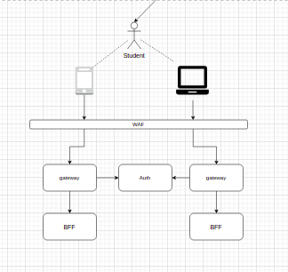

<h1><a href="./../"> 🔙 </a> Template Case </h1>

## Descrição

Descrição do template fica aqui

## Critérios de Aceite

1. 123
1. 1231 

## Arquitetura Macro

<table>
    <tr>
        <td>
            
        </td>
         <td>
            
        </td>
         <td>
            
        </td>
    </tr>
</table>