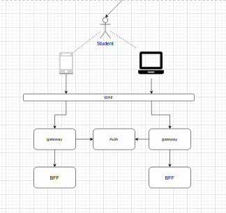

<h1><a href="./../"> 🔙 </a> Nível 1 (Qualidade)</h1>

## Resumo

Resumo da arquitetura utilizada, e o porque ela seria considerada de nivel 1.

* QTDe de Serviços: 21

## Contextos envolvidos

| Contextos                  | Resumo                                            |
| -------------------------- | ------------------------------------------------- |
| Autentição                 | ---                                               |
| Compras                    | ---                                               |
| Checkin & Checkout         | ---                                               |
| Cadastro                   | ---                                               |
| Financeiro                 | ---                                               |

## Serviços envolvidos

| Serviços                   | Responsabilidade                                  |
| -------------------------- | ------------------------------------------------- |
| Microserviço A             | ---                                               |
| Microserviço B             | ---                                               |
| Microserviço C             | ---                                               |
| Microserviço D             | ---                                               |
| Microserviço E             | ---                                               |
| Microserviço F             | ---                                               |

## Tecnológias envolvidas

| Tecnologia    | Aonde esta sendo usada  | Porque esta sendo usada |
| ------------- | ----------------------- | ----------------------- |
| Kafka         | ---                     | ---                     |
| Kong          | ---                     | ---                     |
| Keycloak      | ---                     | ---                     |
| ElasticSearch | ---                     | ---                     |
| MongoDB       | ---                     | ---                     |
| REDIS         | ---                     | ---                     |

## Patterns utilizados

| Patterns                   | Aonde foi usado                                   |
| -------------------------- | ------------------------------------------------- |
| Patterns 1                 | ---                                               |
